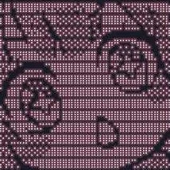

```md
# iskra ~/$ whoami
Abdul Rehman / iskra
Cybersecurity • Pentesting • CTFs • Bugs Hunting • Wanna be a hacker.
```
---

<table> 
<tr>
<td width="25%" align="center">  
</td> 
<td>   
  
```bash 
iskra@kali ~
-----------------------------
OS : Kali Linux
Role : Cybersecurity & CS Student
Focus : Bug Hunting, Web Security, CTFs
Labs : HTB / PortSwigger / VulnLab / CTFs / WEB Kids 2.0
Status : Building • Learning • Breaking
```
</td> 
</tr> 
</table>

## SKILLS

```txt
• Web Pentesting
• Bug Bounty Hunting
• CTF Problem Solving
• Linux / CLI
```
# About
Computer Science student focused on cybersecurity, web application security, and vulnerability research.

---

## CONTACT

GitHub → https://github.com/abdorehman

LinkedIn → https://www.linkedin.com/in/1skra/
